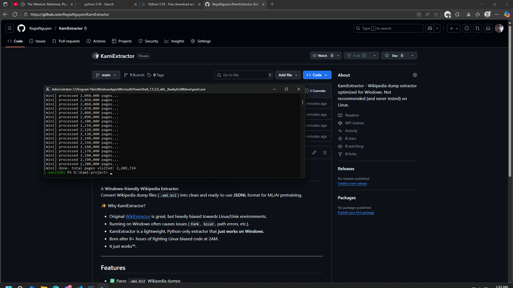
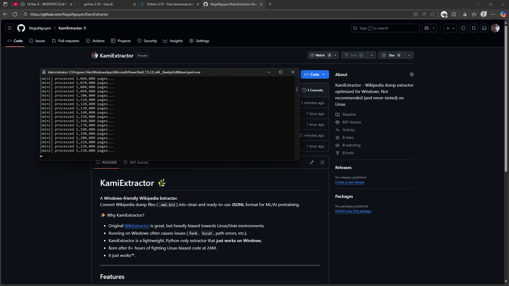
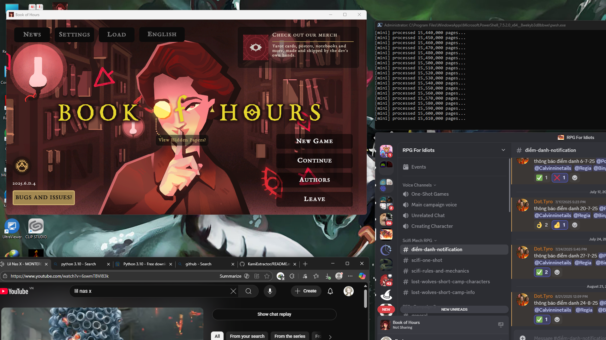

# KamiExtractor 🌿

A **Windows-friendly Wikipedia Extractor**.  
Convert Wikipedia dump files (`.xml.bz2`) into clean and ready-to-use **JSONL** format for ML/AI pretraining.

✨ Why KamiExtractor?
- Original [WikiExtractor](https://github.com/attardi/wikiextractor) is great, but heavily biased towards Linux/Unix environments.
- Running on Windows often causes issues (`fork`, `bzcat`, path errors, etc.).
- KamiExtractor is a lightweight, Python-only extractor that **just works on Windows**.
- Born after 8+ hours of fighting Linux-biased code at 2AM.  
- It just works™.

---

## Features
- ✅ Parse `.xml.bz2` Wikipedia dumps
- ✅ Output JSONL files (`.jsonl`)
- ✅ Configurable limit on number of pages
- ✅ Handles namespaces filtering
- ✅ Designed for **Windows compatibility**

---

## Quick Start

git clone https://github.com/YOUR_USERNAME/KamiExtractor.git
cd KamiExtractor

# Run extractor (💡 On Windows PowerShell, replace \ with ` for line continuation.)

python tools/mini_extractor.py \
  --input path/to/viwiki-latest-pages-articles.xml.bz2 \
  --output extracted_viwiki \
  --json \
  --max-bytes 104857600 \
  --limit 100000 (or just remove this limit to processes them all) 

## 📸 Demo

KamiExtractor running live on Windows PowerShell —  
born after 8 hours of fighting Linux-biased code at 2 AM.  
(Yes, it really chews through millions of pages while Lil Nas X plays in the background 🎶)

## Milestone  
- Total pages visited: **2,209,724** viwiki articles (.bz2) and **24,878,638** enwiki articles (.bz2). 
- Surpassed **17,000,000** pages from English Wikipedia (.bz2) — stable run even while multitasking (games, Discord, YouTube).  
- No crashes.  
- No data corruption.  
- *It just works™.*

